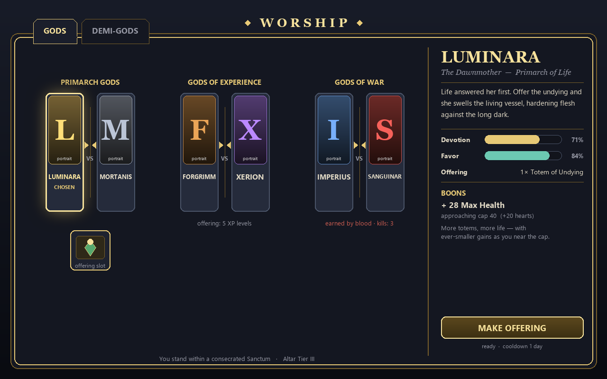
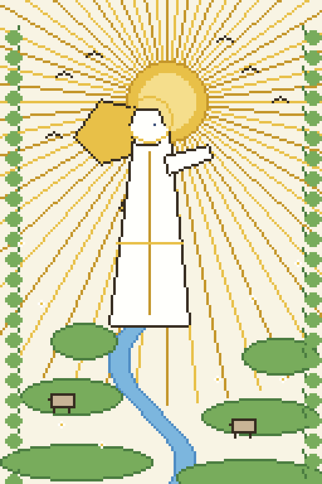

# Mortals & Gods: Build Your Own Pantheon!

**Found a religion, raise altars, follow a pantheon, and earn boons from gods you design.**

*A data-driven worship mod for NeoForge 1.21.1, by barunn.*



*Concept preview of the full-screen worship UI: pantheon tabs across the top, opposed god cards in the panel, and a creed with devotion, favor, and boons on the right.*

Mortals & Gods turns faith into a living system. Stack ore beneath an enchanting table to raise an Altar, wall it into a Sanctum, then open a full-screen worship screen to venerate a pantheon you control. Each opposed pair of gods forces a choice (life or death, craft or magic, order or slaughter), and you may follow only one god of a pair at a time. Offer to your chosen gods and their boons grow along a devotion curve; neglect the faith and that power quietly fades. Mortals can ascend too: a living ruler, the Emperor, can be worshipped or hunted, his body swelling or shrinking with the realm's favor.

Everything the pantheon contains is data-driven. The bundled gods are a ready-to-play starting preset; you can rename, reskin, replace, or add as many of your own as you like through plain JSON, with no code and no crashes.

> **Nothing to craft, nothing to find.** Out of the box the mod ships the Warborn Realms pantheon, its art, and its lore, so you can just play. You only open the config folder if you want to build your own gods, and a mistyped god is simply skipped with a log warning while the rest keep working.

## The Altar

There are no crafted items and no structures to hunt down. Worship happens at an Altar you build yourself: an enchanting table standing on a 3x3 platform of ore blocks, enclosed inside a room called the Sanctum.

```
Enchanting Table        (on top, centered)

O O O
O O O   <- 3x3 ore-block base, directly beneath the table
O O O
```

`O` is any counted ore block: Copper, Iron, Gold, Emerald, Diamond, or Netherite block.

**Arming the altar:** all nine blocks under the table must be counted ore blocks, and the table must sit inside an enclosed room (the Sanctum). The Sanctum is found by a flood-fill of the open space around the table; if that space leaks to the outdoors (larger than 5000 air cells) it counts as open air and the altar does not arm.

**Altar tier (1 to 4)** is an offering multiplier, not a bigger build requirement. It is the total *value* of ore blocks adorning the temple: the 3x3 base plus every ore block that borders the Sanctum's open space (walls, floor, ceiling, pillars, freestanding blocks), each counted once. A richer, more golden temple worships harder.

### Ore block values

| Block | Value |
|---|---|
| Copper Block | 1 |
| Iron Block | 2 |
| Gold Block | 4 |
| Emerald Block | 6 |
| Diamond Block | 10 |
| Netherite Block | 24 |

Default tier thresholds (configurable): Tier 2 at value 32, Tier 3 at 96, Tier 4 at 256; anything below Tier 2 stays Tier 1. A consecrated Sanctum can also fill with gentle holy light motes and a faint chime, growing denser at higher tier (this ambiance can be turned off in the config).

## Worshipping

Stand inside an armed Sanctum and press **B** (the default "beseech" key, rebindable under Controls in the "Mortals & Gods" category) to open the worship screen. Opening it makes your character kneel at the altar; the kneel holds while the screen is open and ends when you close it, or on death or logout.

| Action | How |
|---|---|
| Open the worship screen | Press **B** while standing in an armed Sanctum. |
| Read a creed | Click a god's card to show its lore, devotion, favor, offering cost, and boons. |
| Choose a god | Click the choose button on a card (its label can be a custom verb, such as "Bleed for Sanguinar"). |
| Offer | Use the offer button to spend the god's currency and gain devotion. |
| Switch tabs | Click a bookmark at the top (Gods, Demi-Gods, any author-defined tabs, then Lore). |
| Scroll | Mouse wheel scrolls a crowded god panel or the Lore tab. |
| Watch your kneel | **F1** hides the UI so the world shows through; **F5** cycles the camera perspective from inside the screen. |

The kneel pose is drawn by each viewer's own client, so only players who also run this mod will see you kneeling.

## The Gods and Their Pantheon



*Concept art of Luminara, one of the gods in the bundled Warborn Realms pantheon.*

Gods are arranged in **groups** (opposed pairs) laid out on bookmarked **tabs**. Within a group you may follow only one god at a time. Switching to the other god in a pair burns your old devotion to it (the opposites are jealous) and clears any charge pool tied to the god you abandoned.

### Offering and devotion

An offering at the Altar consumes the chosen god's currency, advances your devotion by one step, and stamps a cooldown. The Altar tier acts as a multiplier: a Tier 3 altar consumes three times the currency but grants three devotion per offering. Currencies come in three kinds:

- **Item:** hand over a stack, such as a Totem of Undying or any item the pantheon author names.
- **XP:** spend experience levels.
- **Kill:** earned in combat by slaying the rival faction, not by offering at the altar. Kill-currency gods (War, Demi-God) cannot be fed at the altar.

### Boons and blessings

Every boon grows along the same saturating devotion curve: it climbs quickly at first, then eases toward a ceiling. A god may stack several boons at once. The available boon types include bonus max health, totem-style auto-revives, extra gear durability, longer reach, bonus mana, stronger potion effects, favor theft on kill, body-scaling, generic attribute bonuses, and a scoreboard output that writes your live worship value into an objective for datapacks or KubeJS to react to. Each boon's ceiling and grind are set per god in the pantheon data.

### Favor decay

If you neglect a god past a grace period, its devotion slowly bleeds off, processed once per whole in-game day. War and Demi-God groups decay more slowly, because their kill-currency is scarce to earn.

### Demi-Gods: the living Emperor

The Demi-Gods tab worships a living ruler rather than a myth. Net favor (the loyalists' worship minus the rejecters' devotion, tallied across all players) scales the crowned player's body: hunt his loyalists hard enough and he physically shrinks until he can be killed. Within a demigod group the first god listed is the worship side and the rest are reject sides. The power is spread evenly across Health, Strength, Speed, and Reach, each capped by the config. Who the Emperor is comes from a config list of player names or from the `/mortalsgods emperor set` command.

## For Pack Makers

Mortals & Gods is built to be reshaped. The gods themselves (names, lore, colors, currencies, boons, and art) live in `config/mortalsgods/pantheon.json`, which is generated with the Warborn Realms defaults on first run alongside a README, an `images/` folder, and an optional `lore.txt`. You can define an entirely new pantheon, or several, without touching the code.

- **Custom tabs:** any `tab` id on a group becomes a bookmark. Declare a top-level `tabs` array to control the order, labels, and gating. The Lore bookmark is always pinned last.
- **Exclusive "one pantheon" tabs** (`"exclusive": true`): a player may follow several gods inside one exclusive tab, but cannot pledge to a second exclusive tab at the same time (Greek OR Egyptian, not both). The `/mortalsgods renounce` command releases a player's exclusive pledges so they can switch.
- **Access gates** (`"require": { ... }`): gate a tab, group, or individual god behind scoreboard tags (`tag`, `allTags`, `anyTags`, `noneTags`) and objective scores. Failed entries are hidden server-side and cannot be worshipped even by a modified client.
- **Custom god pictures:** drop a 200x380 PNG into `config/mortalsgods/images/` named after a god's id, or point a god's `art` field at a filename. Images are read from each client's own config folder.
- **Custom lore:** replace the built-in saga synopsis by writing `config/mortalsgods/lore.txt`, where `#` lines are headings and other lines are paragraphs.
- **Scoreboard boon:** wire worship state directly into your own datapack functions or KubeJS scripts by giving a god a scoreboard boon; the objective is created and zeroed automatically.

A mistyped or invalid god is skipped with a log warning while the rest of the pantheon keeps working, so packs never crash on a bad entry. Server operators can apply edits live with `/mortalsgods reload`, no restart required.

## Compatibility

All integrations are optional soft dependencies, checked at runtime. None are bundled and none are required.

- **Pehkui** scales the living Emperor's body and backs the body-scaling boon. Without it, the Demi-God scaling simply does nothing.
- **Iron's Spells 'n Spellbooks** backs the mana boon. Without it, mana boons have nothing to apply to.
- **War 'n Nobility** is a reserved hook for reading the live Emperor's identity (currently set manually by command).

## Supported Versions

| Loader | Minecraft |
|---|---|
| NeoForge | 1.21.1 |

## Available on CurseForge

Mortals & Gods: Build Your Own Pantheon! is published on CurseForge by barunn.

**[View barunn's projects on CurseForge](https://www.curseforge.com/members/barunn/projects)**
